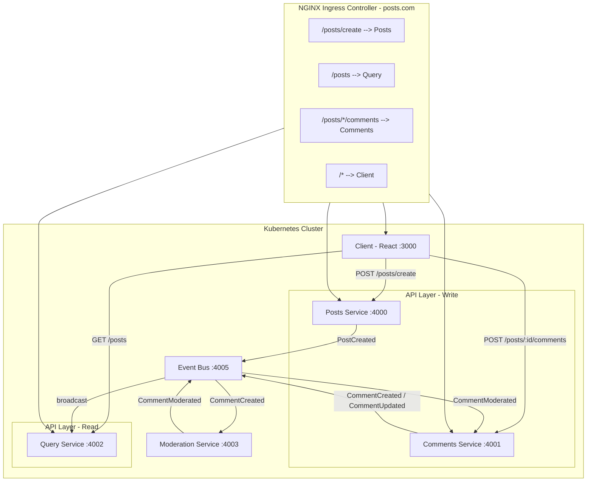
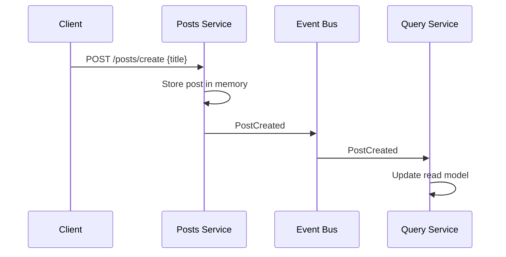
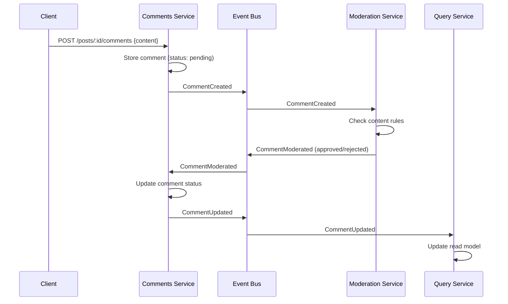

# Blog - Microservices Architecture

A microservices-based blog application built with **Node.js**, **React**, and **Kubernetes**. This project demonstrates key distributed systems patterns including **Event-Driven Architecture**, **CQRS**, and **Event Sourcing**.

## Architecture Overview



### Event Flows

#### Create Post



#### Create Comment



## Tech Stack

| Layer            | Technology                   |
| ---------------- | ---------------------------- |
| Frontend         | React 18, Bootstrap 4, Axios |
| Backend          | Node.js, Express             |
| Communication    | HTTP/REST, Custom Event Bus  |
| Orchestration    | Kubernetes, Skaffold         |
| Containerization | Docker (Alpine Node images)  |
| Ingress          | NGINX Ingress Controller     |

## Services

| Service        | Port | Description                                        |
| -------------- | ---- | -------------------------------------------------- |
| **Client**     | 3000 | React SPA — create posts, view posts & comments    |
| **Posts**      | 4000 | Creates and stores blog posts                      |
| **Comments**   | 4001 | Creates comments, handles status updates           |
| **Query**      | 4002 | Read model — denormalized view of posts + comments |
| **Moderation** | 4003 | Validates comment content (rejects word "orange")  |
| **Event Bus**  | 4005 | Central event dispatcher and event store           |

## Getting Started

### Prerequisites

- [Docker](https://www.docker.com/)
- [Kubernetes](https://kubernetes.io/) (Docker Desktop K8s or Minikube)
- [Skaffold](https://skaffold.dev/)
- NGINX Ingress Controller

### Setup

1. **Enable Kubernetes** in Docker Desktop or start Minikube.

2. **Install NGINX Ingress Controller:**

   ```bash
   kubectl apply -f https://raw.githubusercontent.com/kubernetes/ingress-nginx/controller-v1.8.2/deploy/static/provider/cloud/deploy.yaml
   ```

3. **Add host entry** (for local development):

   ```bash
   # Add to /etc/hosts
   127.0.0.1 posts.com
   ```

4. **Start the application:**

   ```bash
   skaffold dev
   ```

5. **Open the app** at [http://posts.com](http://posts.com).

## Design Patterns

- **CQRS** — Separate write services (Posts, Comments) from the read service (Query)
- **Event Sourcing** — All state changes propagated as events through the Event Bus
- **Event Replay** — Query service replays full event history on startup to rebuild state
- **Eventual Consistency** — Read model is eventually consistent with write models

## API Endpoints

```
POST /posts/create          Create a new post        { title }
GET  /posts                 Get all posts + comments  (via Query service)
POST /posts/:id/comments    Add a comment             { content }
```

## Notes

- All services use **in-memory storage** — data is lost on service restart
- This is a **learning/demo project** illustrating microservices patterns
- For production use, add a persistence layer (MongoDB, PostgreSQL, etc.), retry logic, and proper error handling
